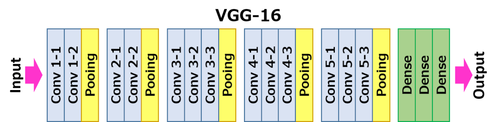

# VGG16_Model

<h1>Training VGG16 model in keras</h1>

keras_VGG16.ipynb is created using google colab.Here, dog vs Cat datasets were taken from kaggle competition and the model was trained with 5002 of training images and 202 of validation images.

note:consider settings in colab

Runtime --> Change runtime type -> GPU

output is softmax layer with 2 classes (i.e) dog or cat
